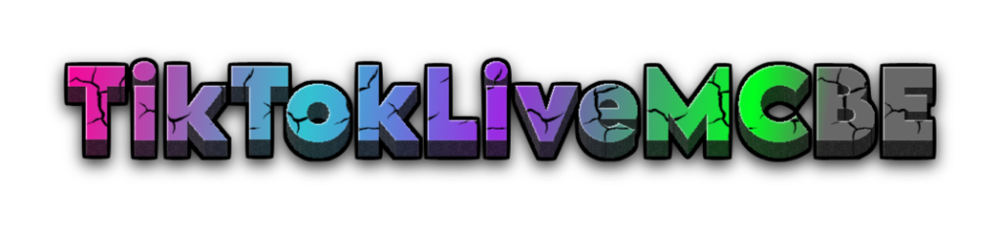
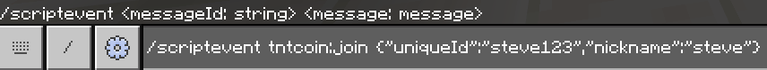
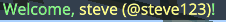

<div align="center">



# TikTokLiveMCBE

</div>

<p align="center">TikTokLiveMCBE is a simple tool that connects your TikTok Live stream with your Minecraft.</p>

## Setup Tutorial on Termux

Click the image below to watch the full setup tutorial on YouTube!

<div align='center'>

[](https://youtu.be/GQu1S_rnxkY?feature=shared)

</div>

## Installation

### Prerequisites

Before you begin, ensure you have Node.js installed. If you're on a mobile device, you can use Termux to run this WebSocket server.

- [Download & Install Node.js](https://nodejs.org/)

1. Download the Latest Release

Download the latest version of TikTokLiveMCBE. Look for the ZIP file in the list of assets.

> - [Download TikTokLiveMCBE](https://github.com/rqinix/TikTokLiveMCBE/releases/)
>
> **_Show your support by giving it a ⭐!_**

2. Uncompress the ZIP File

- Once the download is complete, uncompress the ZIP file.

3. Navigate to the Project Directory

```bash
cd TikTokLiveMCBE
```

4. Install the Dependencies

```bash
npm install
```

or if you prefer Yarn, first install Yarn globally:
```bash
npm install --global yarn
```

Then install the dependencies:
```bash
yarn install
```

5. Set Up Configuration

Create an `.env` file in the root directory

```bash
TIKTOK_USERNAME=tiktok_username
PORT=3000 # or any other port you want to use
```

> **Note:** The TIKTOK_USERNAME should be the username of the TikTok account you want to connect to.

6. Start the Server

Start the TikTokLiveMCBE server:
```bash
npm start
```
or if you're using Yarn:
```bash
yarn start
```

> When you start the TikTokLiveMCBE server, it will attempt to connect to the TikTok live stream associated with the username specified in the .env file.

7. Connect Minecraft to Server

In your Minecraft, connect to the server by typing the following command:
```bash
/connect localhost:3000
```
Replace `localhost` with your server’s IP address if you are not running it locally.

## Usage

### Subscribe to Minecraft Events

In your application file (e.g. `app.ts`), you can subscribe to Minecraft events like this:
```ts
import { connection } from "./core/MinecraftTikTokBridge.js";

const { tiktok, minecraft } = connection;

// Subscribe to Minecraft Events
minecraft.subscribeToEvents([
    "PlayerMessage",
    "BlockBroken",
    "BlockPlaced",
    // ... other events
]);

// Handle Events

minecraft.on("PlayerMessage", (data) => {

    console.log(`PlayerMessage Event: ${data}`);

});

minecraft.on("BlockBroken", (data) => {

    console.log(`BlockBroken Event: ${data}`);

});

minecraft.on("BlockPlaced", (data) => {

    console.log(`BlockPlaced Event: ${data}`);

});

// ...
```

Whenever a player sends a message, breaks a block, or places a block, these events will be triggered, and the corresponding code will be executed, such as logging the event data to the console.

For example, when a PlayerMessage event is triggered, the event data is logged as follows:
```ts
console.log(`PlayerMessage Event: ${data}`);
```

This will output the following in the console:
```bash
PlayerMessage Event: {"body":{"message":"hello","receiver":"","sender":"Steve","type":"chat"},"header":{"eventName":"PlayerMessage","messagePurpose":"event","version":17039360}}
```

Similarly, for the BlockBroken event:
```ts
console.log(`BlockBroken Event: ${data}`);
```

The console output will look like this:
```bash
BlockBroken Event: {"body":{"block":{"aux":0,"id":"grass_block","namespace":"minecraft"},"count":1,"destructionMethod":0,"player":{"color":"ffededed","dimension":0,"id":-4294967295,"name":"Steve","position":{"x":2.987498283386230,"y":-56.45503997802734,"z":14.11897277832031},"type":"minecraft:player","variant":0,"yRot":-95.82889556884766},"tool":{"aux":0,"enchantments":[],"freeStackSize":0,"id":"iron_pickaxe","maxStackSize":1,"namespace":"minecraft","stackSize":1},"variant":0},"header":{"eventName":"BlockBroken","messagePurpose":"event","version":17039360}}
```

And for the BlockPlaced event:
```ts
console.log(`BlockPlaced Event: ${data}`);
```

This will output:
```bash
BlockPlaced Event: {"body":{"block":{"aux":0,"id":"diamond_block","namespace":"minecraft"},"count":1,"placedUnderWater":false,"placementMethod":0,"player":{"color":"ffededed","dimension":0,"id":-4294967295,"name":"Steve","position":{"x":11.93433761596680,"y":-56.45503997802734,"z":13.82549858093262},"type":"minecraft:player","variant":0,"yRot":-95.34191131591797},"tool":{"aux":0,"enchantments":[],"freeStackSize":0,"id":"diamond_block","maxStackSize":64,"namespace":"minecraft","stackSize":64}},"header":{"eventName":"BlockPlaced","messagePurpose":"event","version":17039360}}
```

### Sending Minecraft Commands
```ts
minecraft.sendCommand('say hello, world!');
```

### Handling TikTok Events

You can also handle TikTok events, such as receiving gifts, likes, chats and follows, as shown below:

```ts
import { connection } from "./core/MinecraftTikTokBridge.js";

const { tiktok, minecraft } = connection;

// ...

tiktok.events.onGift(data => {
    // If this is a streakable gift and the streak is NOT ending, handle it temporarily
    if (data.giftType === 1 && !data.repeatEnd) {
        minecraft.sendCommand(`say ${data.uniqueId} is sending gift ${data.giftName} x${data.repeatCount} (streak in progress)`);
        return;
    }

    // Otherwise, process the gift (final count, send Minecraft message, etc.)
    const { giftName, uniqueId, nickname } = data;
    minecraft.sendCommand(`tellraw @a {"rawtext":[{"text":"§a§l${nickname} §7has sent §a§l${giftName} x${data.repeatCount}"}]}`);
});

tiktok.events.onChat(data => {
    const { uniqueId, nickname, comment } = data;
    minecraft.sendCommand(`tellraw @a {"rawtext":[{"text":"§a§l${nickname} §7says: §a§l${comment}"}]}`);
});

tiktok.events.onLike(data => {
    const { uniqueId, nickname, likeCount } = data;
    minecraft.sendCommand(`tellraw @a {"rawtext":[{"text":"§a§l${nickname} §7liked the stream §a§l${likeCount} times!"}]}`);
});

tiktok.events.onFollow(data => {
    const { uniqueId, nickname } = data;
    minecraft.sendCommand(`tellraw @a {"rawtext":[{"text":"§a§l${nickname} §7has followed the stream!"}]}`);
});

tiktok.events.onShare(data => {
    const { uniqueId, nickname } = data;
    minecraft.sendCommand(`tellraw @a {"rawtext":[{"text":"§a§l${nickname} §7has shared the stream!"}]}`);
});

// ...
```

## Using TNT Coin Add-On

- [Download TNT Coin Addon](https://github.com/rqinix/TNTCoin/releases)

In your application file (e.g., `app.ts`), you can enable the TNTCoin extension as follows:
```ts
import { connection } from "./src/core/MinecraftTikTokBridge.js";

// import the TNT Coin
import { useTNTCoin } from "./src/extensions/tntcoin.js";

// Enable the TNTCoin extension
useTNTCoin();

//...
```

The TNTCoin extension listens for various TikTok events, such as join, like, chat, and gift events, and sends corresponding script events to Minecraft. These script events include messages containing relevant information, such as the nickname and unique ID of the user who triggered the event.

For example, when someone joins the stream, the extension sends a `tntcoin:join` script event to Minecraft, containing the nickname and unique ID of the user who joined:
```ts
tiktok.events.onJoin((data) => {
    // convert our JSON message to string
    const message = JSON.stringify({
        uniqueId: data.uniqueId,
        nickname: data.nickname,
    });

    // send `/scripevent` command to minecraft
    minecraft.sendScriptEvent('tntcoin:join', message);
});
```

This simply just sends a minecraft command:
```bash
/scriptevent tntcoin:join {"uniqueId":"steve123","nickname":"steve"}
```
You can also run this manually in-game if you want to test a function that runs when script event like `tntcoin:join` sent without connecting to server:

<div>




</div>

When the TNTCoin add-on receives the `tntcoin:join` event with the associated message, it triggers a function to execute specific actions:
```ts
// Path to the onJoin event handler: /src/game/events/onJoin.ts

export function onJoin(game: TNTCoin, message: string): void {
    // Parse the JSON message to string
    const data = JSON.parse(message);
    const { nickname, uniqueId } = data;

    // Send a welcome message to the player in Minecraft
    game.player.sendMessage(`§aWelcome, §e${nickname} (@${uniqueId})§a!`);
}
```

<div>



</div>

## Contributing

Feel free to contribute by submitting issues or pull requests. Any improvements or new features are welcome!
